# Workfront Fusion Patterns Playbook
## Decision-Grade Integration Patterns for Workfront + Fusion Platform Owners

## 1) Exec takeaway
- This playbook standardizes **how we trigger, buffer, process, retry, replay, and observe** Workfront+Fusion integrations so they are **predictable, operable, and resilient**.
- Core reliability stack: **(1) event/poll ingestion → (2) queue/buffer → (3) idempotent worker → (4) DLQ + replay → (5) structured logs + Teams alerts**.
- “Exactly once” is implemented as **effectively once** using **deterministic idempotency keys + ledger + safe retries**.

## 2) Assumptions / verification
- Fusion Data Stores are available for state (watermarks, idempotency, DLQ, config, orchestration state).
- Teams is the operational alert destination.
- Non-prod and prod environments exist (or equivalent separation with credentials + configs).
- Lowest practical scheduled interval for queued trigger draining in your environment is **5 minutes** (update per tenant limits if different).

## 3) How to use this playbook
1. Choose a pattern by **integration type** (simple upsert, feed, saga).
2. Apply the **standards appendix** first (naming, logs, errors, promotion, DoD).
3. Use the **maturity model** to decide how much architecture is required.
4. Tune performance knobs only **after** idempotency, DLQ, replay, and observability are in place.

---

# How to use this playbook (1–2 pages)

## Pattern taxonomy (choose one per layer)
1. **Trigger/Ingestion**: Webhook / Watch Events / Polling / Hybrid
2. **Buffer/Backpressure**: Native queued webhook drain / DS inbox / debounce / batch
3. **Processing semantics**: Record-level extRefID / operation-level idempotency ledger / saga state
4. **Resilience**: Classification + retries + DLQ + replay
5. **Operability**: Logs + metrics + Teams alerts + runbook + promotion controls

## How to choose patterns
- Need **near real time** and source supports push → Webhook/Watch Events
- Need **completeness** or source edits happen often → Polling with watermark (or hybrid push + reconcile)
- High bursts / rate limits → Queue + batch + rate guard
- Multi-step dependent side-effects → Saga state + step-level idempotency + locks
- Create-only single-record upsert → extRefID often sufficient (with race awareness)

## Standard logging schema + correlation ID conventions
Required fields in all logs:
- `timestamp`, `env`, `scenarioName`, `routeName`, `runId`, `correlationId`
- `sourceSystem`, `targetSystem`, `objectType`, `objectId`
- `eventId` (if present), `idempotencyKey`, `attempt`, `classification`
- `action`, `durationMs`, `httpStatus`, `errorCode`, `message`
- `payloadHash`, `piiRedacted`

Correlation rules:
- `correlationId`: generated once at ingestion, propagated through all steps and alerts
- `runId`: Fusion execution/run identifier
- `idempotencyKey`: deterministic key for a specific side-effect

## Environment strategy (non-prod / prod)
### DEV
- Developer-owned credentials
- Verbose logs
- Lower alert noise thresholds relaxed or non-paging

### QA/UAT
- Production-like configs and quotas
- Replay/rollback tests required
- Teams routed to non-prod ops channel

### PROD
- Locked connections
- Strict alert routing
- Promotion and rollback discipline enforced

## Definition of Done for a new scenario
A scenario is done only if:
- **Tests:** happy path + duplicate + transient failure + permanent failure + replay
- **Alerts:** Teams alerts configured and validated
- **Runbook:** disable / rollback / replay / validation documented
- **Observability:** structured logs and key metrics emitted
- **Idempotency:** deterministic key strategy documented and tested

---

# Playbook Structure
A) Triggers & Eventing  
B) Scenario Architecture  
C) Routing & Orchestration  
D) Data Modeling & Transformation  
E) API Integration  
F) Error Handling & Resilience  
G) Idempotency & Replay  
H) Observability  
I) Environments & Deployment  
J) Security & Compliance  
K) Performance & Scale  
L) Governance & Operating Model  

---

# A) Triggers & Eventing

## Pattern Card
- Pattern Name  
  **Instant Ingest (Webhook) vs Scheduled Drain (Webhook→Queue/Inbox→Worker)**

- Problem / Why it matters (1–3 bullets)
  - Inline instant processing creates burst-driven failures and brittle retries.
  - Separating ingest from processing improves predictability and backpressure handling.
  - Operators need replayable work items, not just failed executions.

- When to use / When NOT to use
  - **Use inline instant**: low volume, low consequence, cheap downstream, low latency priority.
  - **Use scheduled drain**: bursts, rate limits, expensive transforms, stronger operability needs.
  - **Do NOT use inline** for high-consequence or at-least-once event sources without idempotency.

- Architecture sketch (Mermaid flowchart)
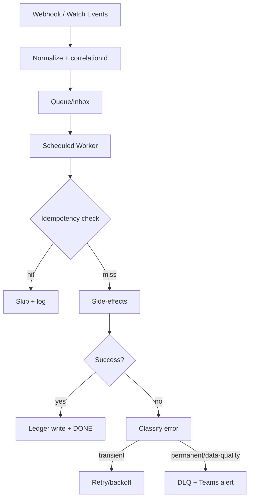

- Fusion implementation (module-by-module steps)
  1. Trigger: Webhooks / Workfront Watch Events
  2. Generate `correlationId` and normalize payload
  3. Enqueue work item (native queue or DS inbox)
  4. Worker reads items on schedule
  5. Config-driven route resolution
  6. Idempotency check (extRefID and/or ledger)
  7. Execute side-effects
  8. On success write ledger + mark done
  9. Error handler: classify → retry or DLQ + alert

- Configuration model (what is parameterized; example config record/table)

| key | routeName | enabled | workerBatchSize | maxRetries | rateLimitPerMin | teamsChannel |
|---|---|---:|---:|---:|---:|---|
| WF_PROJ_UPDATE | project_update | true | 50 | 5 | 120 | ops-prod |

- Data contracts (inputs/outputs; idempotency key strategy)
  - Input work item: `{eventId, objectType, objectId, correlationId, payloadHash, receivedAt}`
  - Output: `{status, processedAt, sideEffectRefs, ledgerRef}`
  - Key strategy: `hash(routeName + objectId + intendedAction + targetSystem)`

- Error handling strategy
  - transient vs permanent vs data-quality classification
    - Transient: 429, 5xx, timeouts
    - Permanent: auth, endpoint/config, non-recoverable 4xx
    - Data-quality: missing required fields, invalid transitions
  - retry/backoff rules
    - 1m, 2m, 4m, 8m, 15m (cap)
  - DLQ/quarantine approach
    - DS `DLQ` with attempts, classification, lastError, payloadHash
  - replay procedure (step-by-step)
    1. Fix root cause
    2. Mark `READY_TO_REPLAY`
    3. Replay worker processes same path
    4. Idempotency prevents duplicates
    5. Mark resolved and notify Teams

- Observability
  - required logs (fields; sample log JSON)
```json
{
  "timestamp":"2026-02-24T21:14:05Z",
  "env":"PROD",
  "scenarioName":"WF_Ingest_Events",
  "routeName":"project_update",
  "runId":"{{runId}}",
  "correlationId":"uuid",
  "sourceSystem":"Workfront",
  "targetSystem":"SAP",
  "objectType":"PROJ",
  "objectId":"12345",
  "eventId":"evt_889177",
  "idempotencyKey":"hash(...)",
  "attempt":0,
  "classification":"N/A",
  "action":"INGESTED",
  "message":"Work item enqueued",
  "payloadHash":"sha256:...",
  "piiRedacted":true
}
```
  - metrics (counters/timers)
    - `processed_count`, `dedupe_hit_count`, `dlq_count`, `retry_count`, `latency_ms`
  - alerts (rules + destinations like Teams)
    - DLQ growth, backlog age, consecutive failures, incomplete execution in PROD

- Security & compliance
  - secrets, least privilege, PII redaction rules
    - Secrets only in Fusion connections
    - Log hashes/IDs, not raw PII payloads

- Environment & release
  - dev/qa/prod differences
    - DEV verbose, QA replay tests, PROD strict alerting
  - promotion checklist items for this pattern
    - Idempotency + DLQ + replay validated
  - rollback/disable procedure
    1. Disable route in config
    2. Optionally disable trigger
    3. Preserve backlog/DLQ
    4. Re-enable and replay

- Edge cases & failure modes (at least 5)
  1. Duplicate deliveries
  2. Out-of-order events
  3. 429 storms
  4. Worker crash mid-batch
  5. Missing eventId
  6. Config drift mid-run

- Testing approach (unit-ish tests, sandbox tests, load/quota tests)
  - Duplicate tests, outage tests, replay tests, burst tests

- Anti-patterns (common mistakes and why they fail)
  - Heavy inline webhook logic
  - No replayable storage
  - Retry everything without classification

- “Copy/Paste Starter” (a short actionable recipe a dev can follow)
  1) Add queue/inbox + DLQ + idempotency ledger  
  2) Normalize + `correlationId`  
  3) Worker + route config + idempotency  
  4) Error handler + Teams alerts  
  5) Replay worker

- References (internal cross-links to other patterns; no external links unless essential)
  - Idempotency Key Ledger
  - Standard Error Taxonomy + DLQ + Replay
  - Config-Driven Router
  - Native Webhook Queue Drain (Scheduled Instant Trigger)

---

## Pattern Card
- Pattern Name  
  **Scheduled Delta Polling with Watermark + Pagination**

- Problem / Why it matters (1–3 bullets)
  - Polling without watermarks causes misses/duplicates.
  - Pagination failures can silently truncate data.
  - Watermark rollback is required for outage recovery.

- When to use / When NOT to use
  - **Use** when no push exists or edits/revisions are common and completeness matters.
  - **Do NOT use** as the only pattern when low-latency push is available and completeness is low consequence.

- Architecture sketch (Mermaid flowchart)
```mermaid
flowchart TD
  A[Scheduler] --> B[Load watermark]
  B --> C[Compute from/to with overlap + safety lag]
  C --> D[API query page]
  D --> E{More pages?}
  E -->|yes| D
  E -->|no| F[Enqueue results]
  F --> G[Advance watermark to max(updatedAt)]
  G --> H[Worker processes idempotently]
```

- Fusion implementation (module-by-module steps)
  1. Scheduler trigger
  2. Get watermark from DS
  3. Calculate `fromTs = watermark - overlap`
  4. Query paginated API with `updatedAt`
  5. Enqueue results
  6. Advance watermark to max timestamp seen
  7. Process with idempotent worker

- Configuration model (what is parameterized; example config record/table)

| routeName | pollEveryMin | overlapMin | safetyLagSec | pageSize | maxPages | watermarkField |
|---|---:|---:|---:|---:|---:|---|
| wf_hours_delta | 5 | 10 | 30 | 200 | 50 | lastUpdateDate |

- Data contracts (inputs/outputs; idempotency key strategy)
  - Input: `{fromTs, toTs, page, pageSize}`
  - Output work item: `{objectId, updatedAt, snapshotHash, correlationId}`
  - Key: `hash(routeName + objectId + updatedAt or snapshotHash)`

- Error handling strategy
  - transient vs permanent vs data-quality classification
    - Poll call failures are transient until proven otherwise; do not advance watermark on failure
  - retry/backoff rules
    - Retry poll safely; preserve watermark
  - DLQ/quarantine approach
    - DLQ item-level malformed records
  - replay procedure (step-by-step)
    1. Roll watermark back by controlled amount
    2. Re-run poll
    3. Let dedupe absorb duplicates

- Observability
  - required logs (fields; sample log JSON)
```json
{
  "timestamp":"2026-02-24T21:20:00Z",
  "env":"PROD",
  "scenarioName":"WF_Hours_Poll",
  "routeName":"wf_hours_delta",
  "action":"POLL_WINDOW_COMPLETED",
  "fromTs":"...",
  "toTs":"...",
  "pages":7,
  "itemsEnqueued":842,
  "watermarkAdvancedTo":"..."
}
```
  - metrics (counters/timers)
    - `poll_items_found`, `poll_pages`, `watermark_lag_ms`, `poll_duration_ms`
  - alerts (rules + destinations like Teams)
    - Watermark lag high, maxPages hit, prolonged zero-results anomaly

- Security & compliance
  - Least-privilege API user, no payload PII in logs

- Environment & release
  - Dev small page size; QA watermark rollback test; PROD monitored lag
  - Rollback: disable route and/or revert watermark after validation

- Edge cases & failure modes (at least 5)
  1. Clock skew
  2. Same timestamp ties
  3. Late arrivals
  4. Partial page responses
  5. Overlap too small / too large

- Testing approach (unit-ish tests, sandbox tests, load/quota tests)
  - Watermark math, rollback/replay, pagination truncation tests

- Anti-patterns (common mistakes and why they fail)
  - Watermark = now
  - No maxPages guardrail
  - Advancing watermark on partial failure

- “Copy/Paste Starter” (a short actionable recipe a dev can follow)
  1) DS `Watermarks`  
  2) Overlap + safety lag  
  3) Paginated poll  
  4) Enqueue + dedupe worker  
  5) Monitor watermark lag

- References (internal cross-links to other patterns; no external links unless essential)
  - Hybrid Trigger: Push + Reconcile
  - Idempotency Key Ledger
  - Standard Error Taxonomy + DLQ + Replay

---

## Pattern Card
- Pattern Name  
  **Workfront Watch Events Subscription → Event Store → Idempotent Worker**

- Problem / Why it matters (1–3 bullets)
  - Watch Events are at-least-once and can duplicate.
  - Over-filtering causes silent misses.
  - Without an event store, replay is weak and audits are painful.

- When to use / When NOT to use
  - **Use** for near-real-time Workfront object changes
  - **Do NOT use alone** for critical completeness-sensitive flows; add reconcile/polling

- Architecture sketch (Mermaid flowchart)
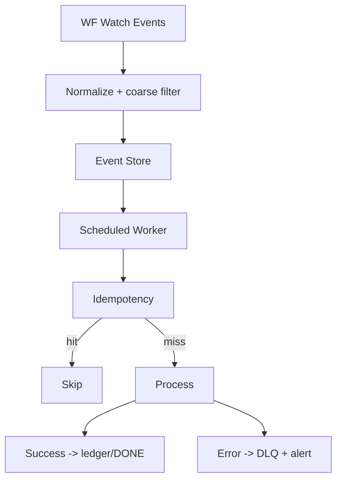

- Fusion implementation (module-by-module steps)
  1. Trigger: Workfront Watch Events
  2. Normalize event fields and `correlationId`
  3. Store event in DS `EventStore` (READY)
  4. Worker scheduled processes READY records
  5. Route config + idempotency + side-effects
  6. Mark DONE or DLQ

- Configuration model (what is parameterized; example config record/table)

| subscriptionName | objectType | eventType | enabled | filterJson | routeName |
|---|---|---|---:|---|---|
| wf_proj_update | PROJ | UPDATE | true | {"DE:Flag":"Recalc"} | project_update |

- Data contracts (inputs/outputs; idempotency key strategy)
  - Input: `{subscriptionId, objectId, eventType, eventTime, payloadHash}`
  - Output: `{status, sideEffectRef}`
  - Key: `hash(subscriptionId + objectId + eventType + payloadHash/eventTime)`

- Error handling strategy
  - Transient on enrichment/API calls; trigger itself should be lightweight
  - DLQ event records with subscription/filter context
  - Replay by flipping status to `READY_TO_REPLAY`

- Observability
  - Logs include `subscriptionName`, `filterHash`
  - Metrics: events received/processed/deduped, DLQ count
  - Alerts: zero events anomaly, DLQ spikes, subscription/systemic failures

- Security & compliance
  - Least privilege Workfront credentials; redact custom form PII

- Environment & release
  - Validate subscriptions and filters in QA
  - Rollback = disable route/subscription and rely on reconcile if configured

- Edge cases & failure modes (at least 5)
  1. Duplicate events
  2. Out-of-order updates
  3. Filter too strict
  4. Filter too broad
  5. Subscription drift/disablement
  6. Schema drift

- Testing approach
  - Controlled WF updates, duplicate generation, replay tests

- Anti-patterns
  - Heavy trigger filtering logic
  - No event store
  - No dedupe

- “Copy/Paste Starter”
  1) Watch Events → EventStore READY  
  2) Worker + idempotency  
  3) DLQ + Teams alerts  
  4) Reconcile if critical

- References
  - Hybrid Trigger: Push + Reconcile
  - Idempotency Key Ledger
  - Standard Error Taxonomy + DLQ + Replay

---

## Pattern Card
- Pattern Name  
  **Push-First with Scheduled Reconciliation Backstop**

- Problem / Why it matters (1–3 bullets)
  - Push streams can miss events.
  - Critical flows require completeness checks.
  - Reconcile can safely repair missing processing if idempotency is stable.

- When to use / When NOT to use
  - **Use** for financially/materially important workflows
  - **Do NOT use** when miss impact is low and complexity cost is unjustified

- Architecture sketch (Mermaid flowchart)
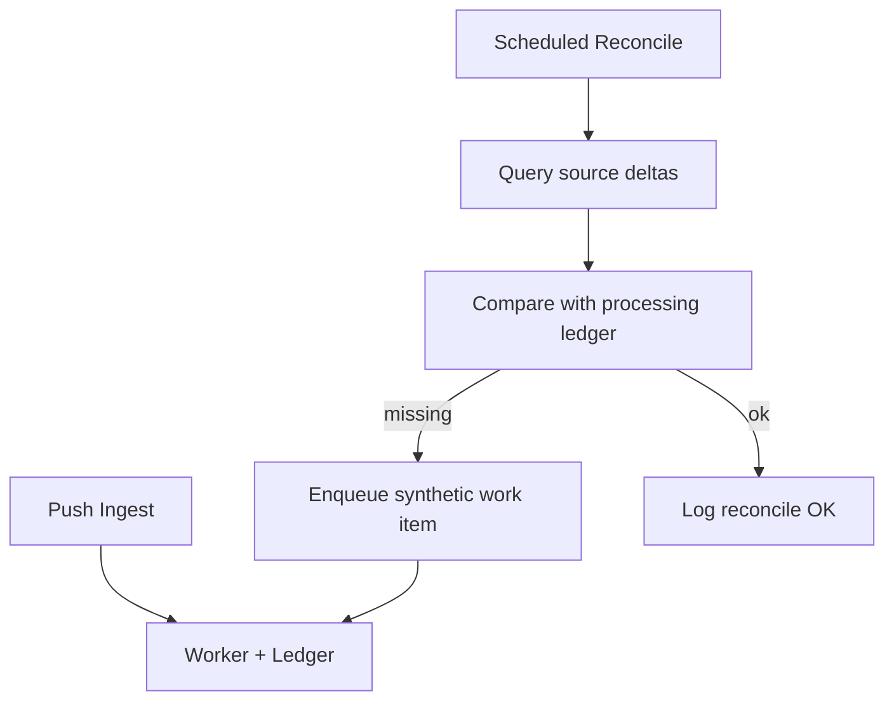

- Fusion implementation (module-by-module steps)
  1. Build normal push path
  2. Build scheduled reconcile scenario with lookback and watermark
  3. Compare source changes to ledger/state
  4. Enqueue synthetic events for missing items
  5. Process through same worker path

- Configuration model (what is parameterized; example config record/table)

| routeName | reconcileEnabled | reconcileEveryMin | reconcileLookbackHours |
|---|---:|---:|---:|
| sap_project_setup | true | 60 | 24 |

- Data contracts (inputs/outputs; idempotency key strategy)
  - Synthetic event must use **same idempotency key formula** as normal path

- Error handling strategy
  - Reconcile failures alert without advancing watermark
  - Replay by rolling back reconcile watermark

- Observability
  - Metrics: checked_count, missing_found_count, synthetic_enqueued_count
  - Alerts: reconcile stale, missing spikes

- Security & compliance
  - Reconcile often requires broader read permissions; keep write scope minimal

- Environment & release
  - QA proves synthetic events do not duplicate side-effects
  - Rollback: disable reconcile feature flag

- Edge cases & failure modes (at least 5)
  1. Ledger retention too short
  2. Lookback window mis-sized
  3. Source query truncation
  4. Schema drift in compare
  5. False positives from compare logic

- Testing approach
  - Intentionally skip push item and verify reconcile repairs it

- Anti-patterns
  - Reconcile writes directly (bypasses idempotency)
  - Different key strategy than normal path

- “Copy/Paste Starter”
  1) Add processing ledger  
  2) Build reconcile query + compare  
  3) Enqueue synthetic events using same worker path

- References
  - Scheduled Delta Polling with Watermark + Pagination
  - Idempotency Key Ledger
  - Standard Error Taxonomy + DLQ + Replay

---

## Pattern Card
- Pattern Name  
  **Native Webhook Queue Drain (Scheduled Instant Trigger)**

- Problem / Why it matters (1–3 bullets)
  - Simplifies architecture by using Fusion’s queued webhook drain instead of a separate ingest scenario.
  - Provides built-in burst absorption.
  - Still requires idempotency, DLQ, replay, and logs for production safety.

- When to use / When NOT to use
  - **Use** when native queue scheduling is available and queue introspection limitations are acceptable.
  - **Do NOT use** if you require a durable, queryable event log or fine-grained queue prioritization.

- Architecture sketch (Mermaid flowchart)
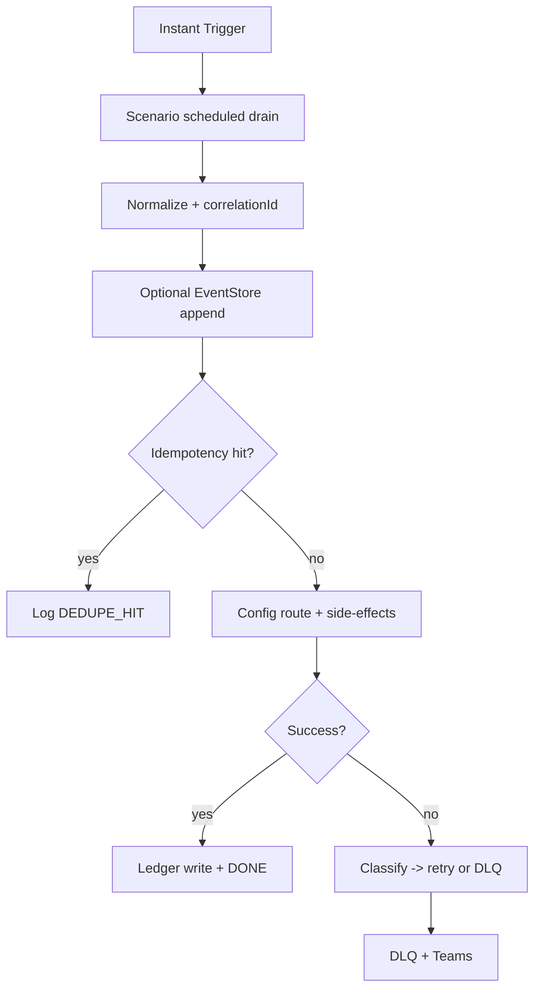

- Fusion implementation (module-by-module steps)
  1. Configure scenario to run queued webhooks on a schedule
  2. Trigger receives queued events
  3. Normalize + compute `correlationId` and `idempotencyKey`
  4. Optional EventStore write (audit)
  5. Ledger check
  6. Config route + side-effects
  7. On success ledger write
  8. Error handler retry/DLQ/Teams

- Configuration model (what is parameterized; example config record/table)

| key | routeName | enabled | drainIntervalMin | maxCyclesPerRun | maxRetries | teamsChannel | rateLimitPerMin |
|---|---|---:|---:|---:|---:|---|---:|
| WF_HOURS_EXPORT | actual_hours_export | true | 5 | 2 | 5 | ops-prod | 120 |

- Data contracts (inputs/outputs; idempotency key strategy)
  - Input: trigger payload + metadata
  - Output: side-effect result + ledger row
  - Key strategy uses eventId or payloadHash/objectId + route action

- Error handling strategy
  - transient vs permanent vs data-quality classification
  - retry/backoff rules
  - DLQ/quarantine approach
  - replay procedure (step-by-step)
    1. Fix root cause
    2. Mark DLQ READY_TO_REPLAY
    3. Replay worker executes same path
    4. Ledger prevents duplicate side-effects
    5. Mark replay success and notify

- Observability
  - required logs (fields; sample log JSON)
```json
{
  "timestamp":"2026-02-24T21:30:00Z",
  "env":"PROD",
  "scenarioName":"WF_Project_Update_ScheduledInstant",
  "routeName":"project_update",
  "runId":"{{runId}}",
  "correlationId":"{{correlationId}}",
  "objectType":"PROJ",
  "objectId":"12345",
  "eventId":"evt_889177",
  "idempotencyKey":"hash(...)",
  "action":"DRAINED_FROM_NATIVE_QUEUE",
  "payloadHash":"sha256:..."
}
```
  - metrics (counters/timers)
    - `processed_count`, `dedupe_hit_count`, `dlq_count`, `processing_duration_ms`, `queue_delay_ms` (if source timestamp available)
  - alerts (rules + destinations like Teams)
    - DLQ growth, consecutive failures, zero throughput anomaly, incomplete execution in PROD

- Security & compliance
  - Use connections for secrets; redact payloads in logs

- Environment & release
  - DEV verbose, QA replay test, PROD strict alerts and locked configs
  - Rollback/disable via route config + scenario disable if necessary

- Edge cases & failure modes (at least 5)
  1. Queue grows faster than drain rate
  2. Out-of-order arrivals
  3. Duplicate deliveries across cycles
  4. Poison payload repeats
  5. Schedule too infrequent
  6. No queue depth visibility

- Testing approach
  - Duplicate, burst, retry classification, replay tests

- Anti-patterns
  - Native queue without idempotency
  - No DLQ (“queue is enough”)
  - Tuning without latency metrics

- “Copy/Paste Starter”
  1) Schedule queued trigger drain  
  2) Compute `correlationId` + `idempotencyKey`  
  3) Ledger check → process  
  4) Error classify → retry/DLQ + Teams  
  5) Replay worker

- References
  - Idempotency Key Ledger
  - Standard Error Taxonomy + DLQ + Replay
  - Burst Buffering
  - Config-Driven Router

---

# C) Routing & Orchestration

## Pattern Card
- Pattern Name  
  **Config-Driven Router (No Hardcoded Routers)**

- Problem / Why it matters (1–3 bullets)
  - Hardcoded route conditions create brittle logic and drift.
  - Config-driven routing enables controlled changes without scenario rewiring.
  - Platform owners can govern behavior through config and promotion.

- When to use / When NOT to use
  - **Use** when >2 routes or changing business rules
  - **Do NOT use** for throwaway prototypes only

- Architecture sketch (Mermaid flowchart)
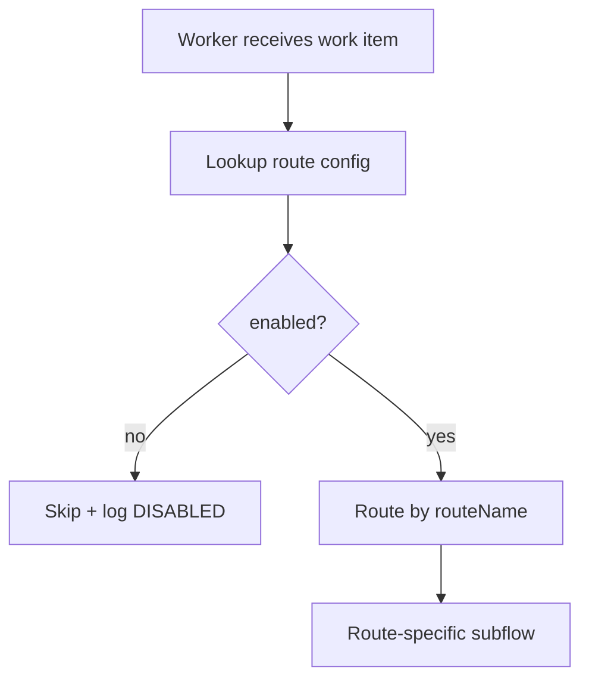

- Fusion implementation (module-by-module steps)
  1. Lookup `Integration_Config` by objectType/eventType/business flags
  2. Resolve `routeName` and route parameters
  3. Router branches on stable route names
  4. Shared subflows for logging/error/idempotency

- Configuration model (what is parameterized; example config record/table)

| routeName | objectType | eventType | enabled | endpointKey | rateProfile | retryProfile |
|---|---|---|---:|---|---|---|
| actual_hours_export | HOUR | UPDATE | true | sap_hours | FEED_SAFE_5MIN | STANDARD |

- Data contracts (inputs/outputs; idempotency key strategy)
  - Input must include route-resolvable fields
  - Output includes `routeName` + key

- Error handling strategy
  - Missing config = permanent (`CONFIG_MISSING`) → DLQ + Teams

- Observability
  - Log config version/hash used for each execution

- Security & compliance
  - Restrict config modification permissions

- Environment & release
  - Promote configs as artifacts; maintain dev/qa/prod parity

- Edge cases & failure modes (at least 5)
  1. Multiple matching configs
  2. Accidental disablement
  3. Config drift across environments
  4. Mid-run config changes
  5. Missing endpoint/rate profiles

- Testing approach
  - Route resolution tests with representative payloads

- Anti-patterns
  - Hardcoding IDs and route logic in filters/routers

- “Copy/Paste Starter”
  1) Create `Integration_Config`  
  2) Resolve `routeName` by lookup  
  3) Branch on routeName only

- References
  - Native Webhook Queue Drain
  - Saga Orchestration State (below)
  - Standard Error Taxonomy + DLQ + Replay

---

## Pattern Card
- Pattern Name  
  **Saga Orchestration State + Step Resume (Low-Volume High-Impact ERP Setup)**

- Problem / Why it matters (1–3 bullets)
  - Multi-step dependent side-effects (project, WBS, plans) often fail partially.
  - Blind reruns create duplicate sub-entities or duplicate postings.
  - Operators need step visibility and deterministic resume behavior.

- When to use / When NOT to use
  - **Use** for dependent workflows (e.g., SAP project setup with multiple required steps)
  - **Do NOT use** for simple single-step upserts or high-volume transactional feeds

- Architecture sketch (Mermaid flowchart)
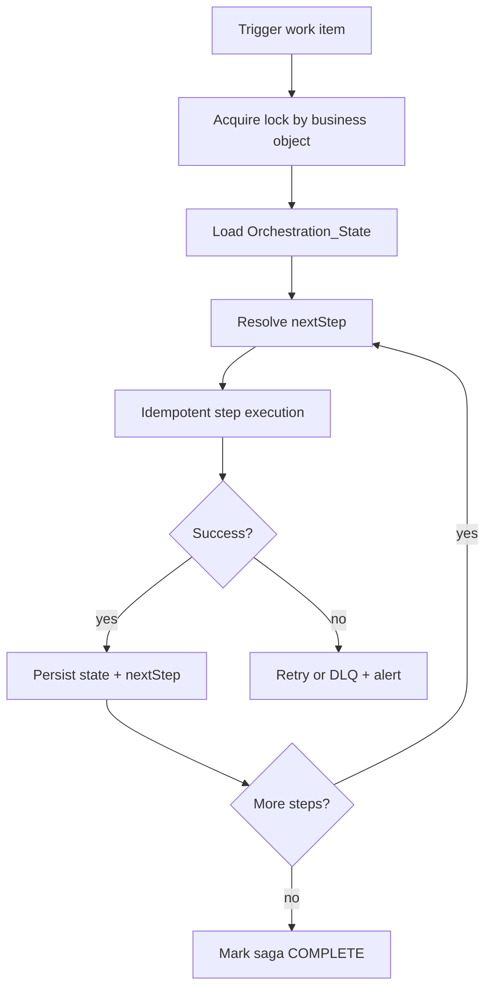

- Fusion implementation (module-by-module steps)
  1. Trigger or worker receives project setup request
  2. Acquire DS lock by `wfProjectId`
  3. Load/upsert `Orchestration_State`
  4. Router on `currentStep/nextStep`
  5. For each step: compute step key → idempotency check → execute SAP call → persist IDs
  6. Update state, release lock
  7. Error handler routes to retry or DLQ with current step context

- Configuration model (what is parameterized; example config record/table)

| routeName | enabled | lockTtlMin | stepRetryProfile | burstMode | maxConcurrentSagas |
|---|---:|---:|---|---:|---:|
| sap_project_setup | true | 30 | SAGA_STANDARD | false | 1 |

- Data contracts (inputs/outputs; idempotency key strategy)
  - Input: `{wfProjectId, correlationId, requestedAction}`
  - State: `{currentStep, stepStatus, sapProjectId, wbsIds, planHashes, lastError, attempts}`
  - Keys:
    - `SAP:CREATE_PROJECT:WF_PROJ:<wfProjectId>`
    - `SAP:CREATE_WBS:L1:<wfProjectId>:<wbsCode>`
    - `SAP:ALLOC_PLAN:<wfProjectId>:<versionHash>`
    - `SAP:FIN_PLAN:<wfProjectId>:<versionHash>`

- Error handling strategy
  - transient vs permanent vs data-quality classification
    - Per-step classification; preserve state and lock release semantics
  - retry/backoff rules
    - Conservative retries to avoid long executions; resume later if needed
  - DLQ/quarantine approach
    - DLQ includes `currentStep`, `wfProjectId`, `sapProjectId`, `lastError`
  - replay procedure (step-by-step)
    1. Fix root cause
    2. Review `Orchestration_State`
    3. Set `status=READY_TO_REPLAY`
    4. Replay resumes from `currentStep`
    5. Validate downstream objects and mark COMPLETE

- Observability
  - required logs (fields; sample log JSON)
```json
{
  "timestamp":"2026-02-24T22:05:00Z",
  "env":"PROD",
  "scenarioName":"WF_to_SAP_Project_Setup",
  "routeName":"sap_project_setup",
  "correlationId":"uuid",
  "objectType":"PROJ",
  "objectId":"WF12345",
  "action":"STEP_COMPLETED",
  "stepName":"CREATE_WBS_L2",
  "idempotencyKey":"SAP:CREATE_WBS:L2:WF12345:ABC-02",
  "message":"WBS level 2 created"
}
```
  - metrics (counters/timers)
    - `saga_started`, `saga_completed`, `saga_failed`, `step_retry_count`, `saga_duration_ms`
  - alerts (rules + destinations like Teams)
    - Any DLQ on this route, incomplete execution in PROD, saga stuck `IN_PROGRESS` > threshold

- Security & compliance
  - Separate SAP credentials by env; least privilege for setup vs financial posting if possible

- Environment & release
  - QA requires partial-failure and resume tests
  - Promotion includes runbook review for step replay
  - Rollback/disable procedure
    1. Disable route
    2. Preserve in-flight state
    3. Reconcile SAP artifacts manually if needed
    4. Replay specific sagas after fix

- Edge cases & failure modes (at least 5)
  1. Duplicate trigger for same project
  2. WBS partial creation before timeout
  3. Plan post succeeds but response times out
  4. Lock stuck after crash
  5. Sequence dependency violated by replay
  6. Config change during in-flight saga

- Testing approach (unit-ish tests, sandbox tests, load/quota tests)
  - Step resume tests, duplicate trigger tests, auth failure tests, batch approvals (5–10) without lock collisions

- Anti-patterns (common mistakes and why they fail)
  - Only top-level extRefID on project
  - Blind full reruns
  - No state store
  - Feed-style high drain tuning

- “Copy/Paste Starter” (a short actionable recipe a dev can follow)
  1) Create `Orchestration_State` + `Route_Locks`  
  2) Implement step router with step-level keys  
  3) Persist SAP IDs after each success  
  4) DLQ with `currentStep` context  
  5) Replay resumes by state, not full restart

- References (internal cross-links to other patterns; no external links unless essential)
  - Idempotency Key Ledger
  - Standard Error Taxonomy + DLQ + Replay
  - Config-Driven Router
  - Trigger Maturity Model (SAGA_CONSERVATIVE_5MIN)

---

# F) Error Handling & Resilience

## Pattern Card
- Pattern Name  
  **Standard Error Taxonomy + DLQ + Replay Worker**

- Problem / Why it matters (1–3 bullets)
  - “Retry everything” burns quotas and hides root causes.
  - Without DLQ, operators use manual reruns as a process.
  - Replay must be safe and policy-driven.

- When to use / When NOT to use
  - **Use for every production scenario**
  - **Do NOT omit** from production routes

- Architecture sketch (Mermaid flowchart)
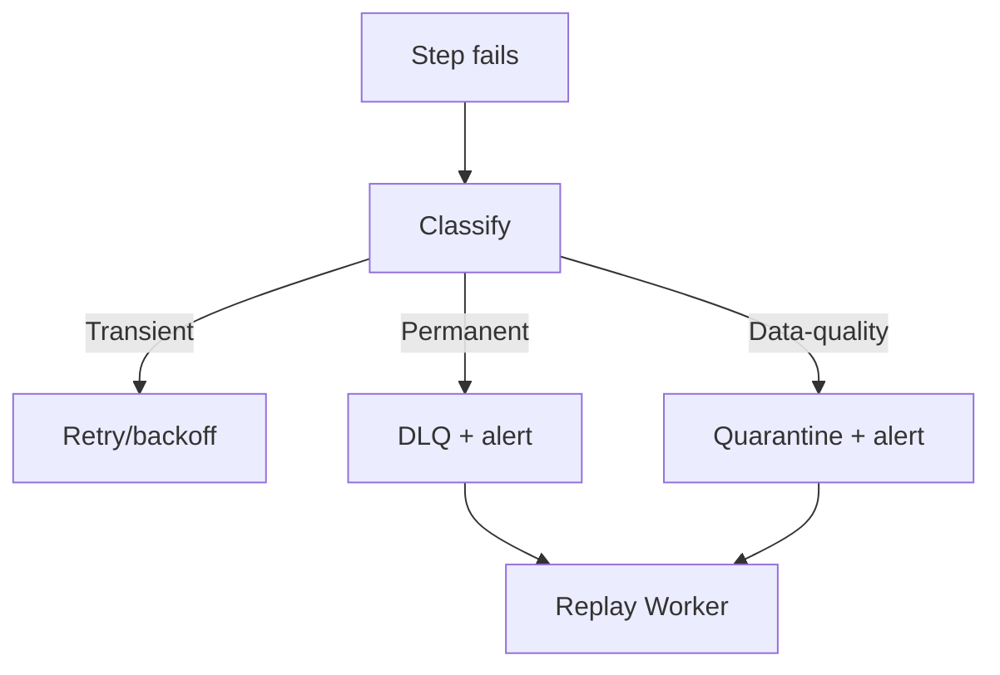

- Fusion implementation (module-by-module steps)
  1. Error handler route around critical side-effects
  2. Classification by status/error type
  3. Retry path with backoff
  4. DLQ write path + Teams alert
  5. Replay worker processes `READY_TO_REPLAY`

- Configuration model (what is parameterized; example config record/table)

| routeName | maxRetries | retryBackoff | dlqSeverity | teamsChannel |
|---|---:|---|---|---|
| actual_hours_export | 5 | 1,2,4,8,15 | high | ops-prod |

- Data contracts (inputs/outputs; idempotency key strategy)
  - DLQ record includes `workItem`, `classification`, `attempts`, `lastError`, `correlationId`, `payloadHash`

- Error handling strategy
  - transient vs permanent vs data-quality classification
  - retry/backoff rules
  - DLQ/quarantine approach
  - replay procedure (step-by-step)
    1. Fix issue
    2. Mark record `READY_TO_REPLAY`
    3. Replay worker runs same path
    4. Validate + close out alert

- Observability
  - required logs, metrics, alerts
  - Metrics: classification breakdown, DLQ age, retry counts
  - Alerts: DLQ count/age and repeated failures

- Security & compliance
  - Restrict DLQ access and redact payloads

- Environment & release
  - Replay tested in QA
  - PROD replay requires runbook and validation checklist

- Edge cases & failure modes (at least 5)
  1. Misclassification loops
  2. DLQ floods from config error
  3. Replay retriggers throttling
  4. Mutated payloads between failure/replay
  5. Alert noise without dedupe

- Testing approach
  - Force 429, 500, 400, auth failure, malformed payload

- Anti-patterns
  - Ad hoc retries everywhere
  - No central replay path

- “Copy/Paste Starter”
  1) Shared error handler subflow  
  2) Central DLQ schema  
  3) Replay worker + Teams alerts

- References
  - All processing patterns

---

# G) Idempotency & Replay

## Pattern Card
- Pattern Name  
  **Idempotency Key Ledger (At-Least-Once → Effectively-Once)**

- Problem / Why it matters (1–3 bullets)
  - Duplicates and retries are normal in distributed integrations.
  - Without idempotency, replays create duplicate side-effects.
  - Ledgers make replay safe and auditable.

- When to use / When NOT to use
  - **Use** for all side-effecting routes
  - **Record-level extRefID only** may be sufficient for simple create/upsert routes, but still document boundary

- Architecture sketch (Mermaid flowchart)
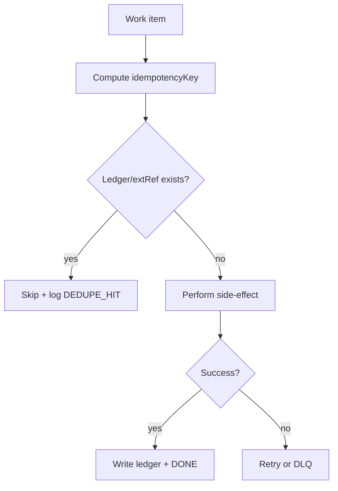

- Fusion implementation (module-by-module steps)
  1. Compute deterministic key
  2. Check DS ledger and/or Workfront/SAP external ref
  3. If hit → skip/log
  4. Else execute side-effect
  5. On success write ledger row

- Configuration model (what is parameterized; example config record/table)

| routeName | keyFormulaRef | uniquenessLevel | ledgerRequired |
|---|---|---|---:|
| actual_hours_export | hours_entry_revision | operation | true |
| simple_task_create | task_extref | record | false |

- Data contracts (inputs/outputs; idempotency key strategy)
  - Ledger row: `{idempotencyKey, routeName, objectId, sideEffectRef, payloadHash, correlationId, createdAt}`

- Error handling strategy
  - Never write ledger before success
  - DLQ preserves key and payload hash for safe replay

- Observability
  - `dedupe_hit_count`, `ledger_write_count`, abnormal changes in dedupe rate

- Security & compliance
  - Ledger stores minimal metadata (no raw payload)

- Environment & release
  - Retention policy documented
  - Key strategy changes require migration/rollout plan

- Edge cases & failure modes (at least 5)
  1. Key too broad
  2. Key too narrow
  3. Non-deterministic hashing
  4. Retention too short
  5. Success occurred but timeout before ledger write

- Testing approach
  - Duplicate delivery and replay tests; simulated timeout after write

- Anti-patterns
  - Using `runId` as key
  - Writing ledger before side-effect

- “Copy/Paste Starter”
  1) Define deterministic key formula  
  2) Check ledger/extRef → execute → ledger write  
  3) Track dedupe metrics

- References
  - Workfront extRefID Idempotency pattern (below)
  - Saga Orchestration State
  - Standard Error Taxonomy + DLQ + Replay

---

## Pattern Card
- Pattern Name  
  **Workfront extRefID Idempotency (Record-Level Upsert by External Reference)**

- Problem / Why it matters (1–3 bullets)
  - For many create/upsert routes, Workfront `externalReferenceID` is the simplest idempotency boundary.
  - Avoids duplicate record creation on replay/duplicates.
  - Must be standardized and race-aware to be safe in production.

- When to use / When NOT to use
  - **Use** for single-record creates/upserts where extRef lookup is supported.
  - **Do NOT rely on it alone** for multi-step sagas or multi-object/cross-system workflows.

- Architecture sketch (Mermaid flowchart)
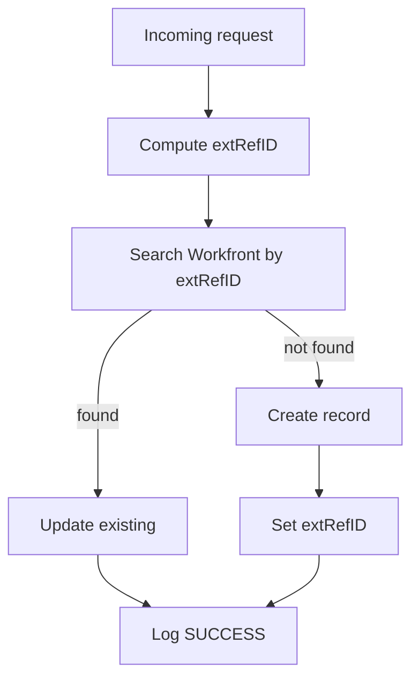

- Fusion implementation (module-by-module steps)
  1. Normalize + `correlationId`
  2. Compute deterministic `extRefID`
  3. Workfront search by extRefID
  4. Router found/not found
  5. Update or create + set extRefID
  6. Structured log + error handling

- Configuration model (what is parameterized; example config record/table)

| routeName | extRefFormat | objectType | uniquenessLevel | lockPolicy |
|---|---|---|---|---|
| task_sync | `<source>:<route>:TASK:<id>` | TASK | record | optional |
| req_create | `<source>:<route>:OPTASK:<id>` | OPTASK | record | single-worker |

- Data contracts (inputs/outputs; idempotency key strategy)
  - extRefID format:
    - `<sourceSystem>:<routeName>:<objectType>:<sourceObjectId>[:<operation>][:<version>]`
  - `idempotencyKey = extRefID` for logs and replay context

- Error handling strategy
  - transient vs permanent vs data-quality classification
  - retry/backoff rules
  - DLQ/quarantine approach
  - replay procedure (step-by-step)
    1. Fix issue
    2. Replay same payload
    3. Search by same extRefID prevents duplicate create

- Observability
  - Log extRefID in all attempts and outcomes
  - Track duplicate/upsert hit rate

- Security & compliance
  - extRefID should not include PII

- Environment & release
  - Namespace extRef by env if cross-env data overlap risk exists

- Edge cases & failure modes (at least 5)
  1. Search-then-create race
  2. Key collisions across routes
  3. Wrong uniqueness level (record vs operation)
  4. extRef not set during create path
  5. Replay on changed source semantics

- Testing approach
  - Duplicate input, concurrency simulation, extRef collision test

- Anti-patterns
  - Ad hoc extRef formats
  - Using record-level extRef for operation-level actions

- “Copy/Paste Starter”
  1) Standardize extRef format  
  2) Search by extRef → update/create  
  3) Log `idempotencyKey = extRefID`  
  4) Add lock for burst/concurrency routes

- References
  - Idempotency Key Ledger
  - Config-Driven Router
  - Trigger Maturity Model (record-level vs operation-level)

---

# H) Observability

## Pattern Card
- Pattern Name  
  **Structured Logs + Metrics + Teams Alert Router**

- Problem / Why it matters (1–3 bullets)
  - Free-text logs slow triage.
  - Alerts without routing become noise.
  - Correlation IDs are required for replay and incident handling.

- When to use / When NOT to use
  - **Always** for production scenarios

- Architecture sketch (Mermaid flowchart)
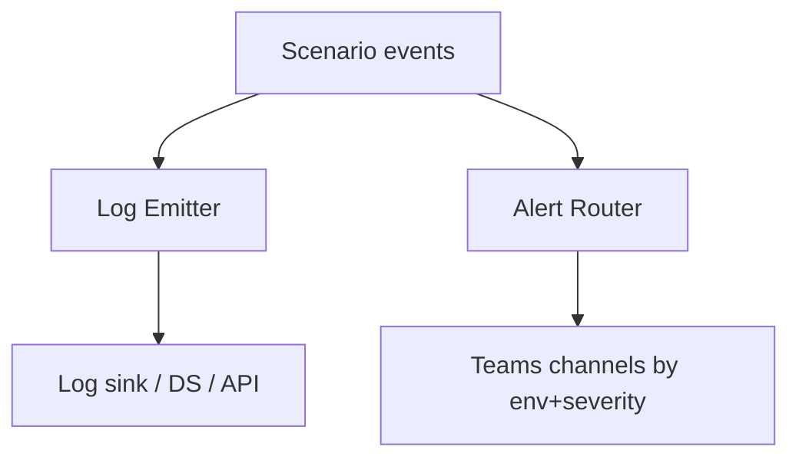

- Fusion implementation (module-by-module steps)
  1. Build shared Log Emitter subflow
  2. Emit logs at ingest, dedupe, side-effect, DLQ, replay
  3. Alert Router maps `(env,severity,routeName)` to Teams destination

- Configuration model (what is parameterized; example config record/table)

| env | severity | routePrefix | teamsChannel | mentions |
|---|---|---|---|---|
| PROD | high | sap_ | ops-prod | @oncall |
| QA | medium | * | ops-nonprod |  |

- Data contracts (inputs/outputs; idempotency key strategy)
  - Alerts include `correlationId`, `objectId`, `routeName`, `classification`, `runbookRef`

- Error handling strategy
  - Logging failure should not block business processing; count and alert separately if persistent

- Observability
  - Metrics: alert counts, logging failures, run durations, DLQ age, backlog age

- Security & compliance
  - Redaction before emit; no secrets in logs

- Environment & release
  - Validate alert routing in QA before PROD

- Edge cases & failure modes (at least 5)
  1. Alert storms
  2. Missing correlationId
  3. PII leakage in logs
  4. Teams throttling
  5. Noisy low-value alerts

- Testing approach
  - Schema validation and alert routing smoke tests

- Anti-patterns
  - Free-text only logs
  - Alerts without context or runbook action

- “Copy/Paste Starter”
  1) Create `Alert_Routes`  
  2) Shared log emitter  
  3) Emit on all control points

- References
  - All patterns

---

# K) Performance & Scale

## Pattern Card
- Pattern Name  
  **Burst Buffering: Queue + Debounce + Batch Worker + Rate Guard**

- Problem / Why it matters (1–3 bullets)
  - Bursts create 429s and long executions.
  - Debounce collapses noisy changes.
  - Batching and rate guards stabilize downstream calls and cost.

- When to use / When NOT to use
  - **Use** for bursty updates and rate-limited downstreams
  - **Do NOT use** if strict per-event ordering and no collapse is allowed

- Architecture sketch (Mermaid flowchart)
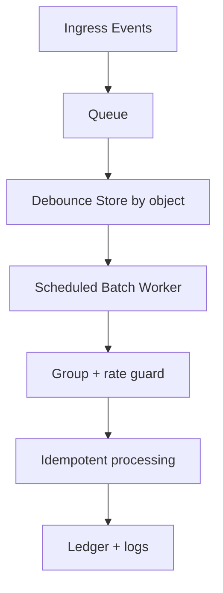

- Fusion implementation (module-by-module steps)
  1. Ingest queue
  2. Upsert debounce record by object key
  3. Worker selects quiet keys older than debounce window
  4. Array aggregate/group
  5. Rate-guarded API calls
  6. Idempotency + ledger

- Configuration model (what is parameterized; example config record/table)

| routeName | debounceWindowSec | batchSize | rateLimitPerMin | maxConcurrentRoutes |
|---|---:|---:|---:|---:|
| actual_hours_export | 60 | 50 | 120 | 1 |

- Data contracts (inputs/outputs; idempotency key strategy)
  - Debounce row: `{routeName, objectId, lastEventAt, payloadHash, correlationId}`
  - Key: route + object + latest snapshot hash

- Error handling strategy
  - transient preserves debounce row
  - permanent/data-quality → DLQ + decide whether to freeze key

- Observability
  - backlog size, debounce pending count, batch duration, 429 rate

- Security & compliance
  - Store hashes/minimal context in debounce store

- Environment & release
  - Start conservatively in PROD; tune by metrics
  - Rollback by disabling debounce feature flag/profile

- Edge cases & failure modes (at least 5)
  1. Debounce window too large
  2. Key too coarse
  3. Overlapping worker runs
  4. Rate guard too low (never drains)
  5. Non-deterministic payload hash

- Testing approach
  - Burst collapse and rate-limit simulations

- Anti-patterns
  - Batching without idempotency
  - Debounce without object identity

- “Copy/Paste Starter”
  1) Add debounce DS  
  2) Batch worker selects quiet keys  
  3) Rate guard + idempotent processing

- References
  - Trigger Maturity Model
  - Idempotency Key Ledger
  - Error Taxonomy + DLQ + Replay

---
